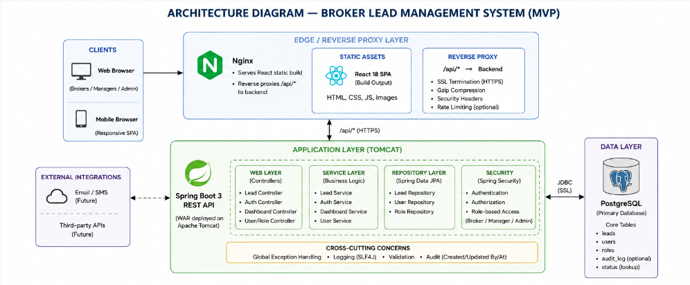
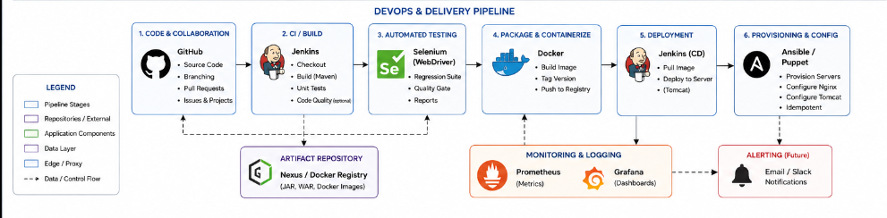

# Broker Lead Management System (BLMS)

## What this is

A web app for brokers to add, view, update, and search leads through a status workflow, with a dashboard for managers to track lead volume by status.

Built over 15 weeks as a full DevOps project. The app, the CI/CD pipeline, the automated tests, the containers, and the server automation are all part of the deliverable, not just the app itself.

## Scope

- Add, view, update, and search leads
- Status workflow: New, Contacted, Qualified, Converted or Lost
- Dashboard with lead counts by status
- Role-based access for brokers, managers, and admins

Not included: notifications, third-party lead integrations, advanced reporting, a mobile app, multi-branch support.

## Architecture

Browser (React) to Nginx to the Spring Boot backend to PostgreSQL.

## Delivery pipeline

## Stack

- Frontend: React 18, Vite
- Backend: Java 17, Spring Boot 3
- Database: PostgreSQL 16
- Build: Maven, npm
- Deploy: Tomcat, Nginx
- CI/CD: Jenkins
- Testing: Selenium, JUnit
- Containers: Docker
- Config management: Ansible or Puppet

## 15-week plan

Week 1: Problem definition and scope. Done.
Week 2: Agile planning and DevOps workflow. Done.
Week 3: Architecture and tech stack. Done.
Week 4: GitHub repo setup. Done.
Week 5: First feature, branch workflow.
Week 6: Rest of the MVP, Git collaboration.
Week 7: Jenkins install, CI job.
Week 8: Pipeline as code, server deploy.
Week 9: Selenium tests, local run.
Week 10: Tests as a Jenkins gate.
Week 11: Docker image, container lifecycle.
Week 12: Jenkins-Docker deploy.
Week 13: Config management script.
Week 14: Provisioning and rollback validation.
Week 15: Final release, docs, demo.

## Structure

    blms/
      backend/
        src/main/java/com/blms/
          controller/
          model/
          repository/
          service/
          config/
      frontend/
        src/
          components/
      docs/
      .github/

## Setup

You need JDK 17, Maven, Node.js, and a PostgreSQL 16 instance running locally.

Backend:

    cd backend
    mvn spring-boot:run

Runs on port 8080. Check it's up with:

    curl http://localhost:8080/api/v1/health

Frontend:

    cd frontend
    npm install
    npm run dev

Runs on port 5173 and proxies /api calls to the backend.

Database connection settings are in backend/src/main/resources/application.yml, or set these env vars:

    DB_URL=jdbc:postgresql://localhost:5432/blms
    DB_USERNAME=blms_user
    DB_PASSWORD=changeme

## Contributing

See CONTRIBUTING.md for branch naming, commit style, and PR process.

## License

MIT
